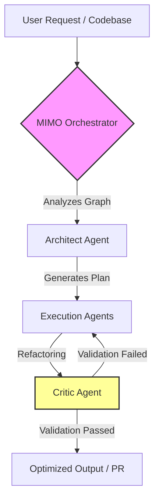

# MIMO-Flow System Architecture

This document outlines the core architecture and data flow of the MIMO-Flow framework.

## ⚙️ Architectural Diagram

The following diagram illustrates the interaction between the Orchestrator, the specialized agents, and the recursive feedback loops implemented in the framework.

## 📂 Component Overview

*   **`agents/`**: Contains the specialized LLM agents.
    *   **Architect Agent**: Performs long-chain reasoning to plan structural changes and system design.
    *   **Coder Agent (Execution)**: Translates the Architect's plan into functional code.
    *   **Critic Agent**: Reviews generated code, providing autonomous validation and optimization feedback.
*   **`core/`**: Houses the main logic.
    *   **Orchestrator**: The central brain that handles routing, task delegation, and execution loops.
    *   **Reasoning Module**: Simulates deep planning and context compression.
*   **`utils/`**: Telemetry and metrics (e.g., Token Counting to manage the 92M+ token throughput efficiently).
*   **`mimo_api/`**: Native wrappers facilitating API connections with Xiaomi MIMO models and other endpoints.
